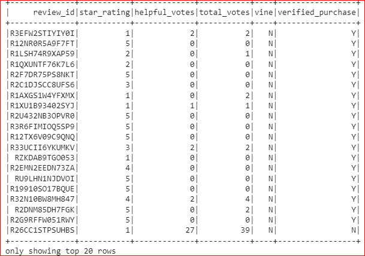

# Amazon Vine Analysis

## Resources: 
Data Source : Amazon Review Dataset, US Software review dataset

## Overview of the analysis
Analyse the amazon vine program dataset, perform ETL (extract, transform & load) on the dataset, connect to AWS RDS instance & load the transformed data to pgAdmin.

## Perform ETL on Amazon Product Reviews:
* Created new database in Amazon RDS server & ran the query to create tables.

### The customers_table DataFrame
* using groupby function on customer_id created customer table dataframe:

     

### The products_table DataFrame:
* Created product_id dataframe form the Amazon dataset.

    

### The review_id_table DataFrame:
 * Converted the date column from string to date format then created the dataframe.

    

    

 ### The vine_table DataFrame:

 * Created the vine table dataframe.

    

 Made the connection to AWS RDS instance & loaded the dataframe in pgAdmin. Ran query to check that the tables have been populated. Below are the images of the four tables in pgAdmin

 

 

 

 

## Determine Bias of Vine Reviews:

### Overview of the analysis
Used SQL to determine if there was any bias towards the reviews written that were wriiten as part of teh vine program.

### Results :
The below results are based on total votes >=20 and helpful_votes/total_votes >= 50%.

1) How many Vine reviews and non-Vine reviews were there?

    1a) There were 248 vine reviews

     

    1b) There were 17514 non-vine reviews 

    

2) How many Vine reviews were 5 stars? How many non-Vine reviews were 5 stars?

    2a) There were 102 five star rating for vine program

    

    2b) There were 5154 five star rating for non-vine program

    

3) What percentage of Vine reviews were 5 stars? What percentage of non-Vine reviews were 5 stars? 

    3a) 41.13% were five star rating in the vine program.

    

    3b) 29.43% were five star rating in the non-vine program

    

### Summary:

There is posivity bias for the reviews in the Vine program as there were 42.13 percentage of the vine whereas there were 29.42 percentage non-vine program.

We could analyse the statistical distribution ( mean, median and mode) of the star rating for the vine & non-vine reviews.
